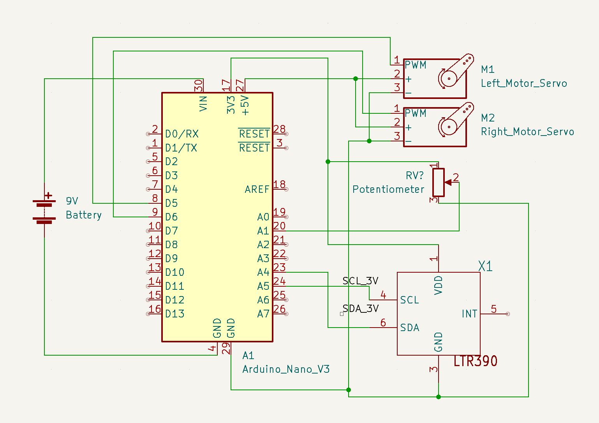

# Hardware

## Overview

The project uses an Adafruit LTR390 to measure the UV light levels. Additionally, a potentiometer has been employed as a mode selector for the apparatus. Finally, both of these send data to a Arduino Nano board that is powered by a single 9V battery and controls two servos.

## Circuit Schematic

 

## Testing

Initially, voltage and power draw were major concerns. Some of the first designs included AA batteries in series or 12V batteries in parallel. However, none of these solutions seemed to aptly fit the requirements of the project. Through a rough calculation of the maximum current draw, and taking into account the max voltage allowed by the internal power supply, we concluded that a 9V battery would best suite our needs. This power source is within the specs of the onboard power supply and will power the device for a reasonable amount of time. 
